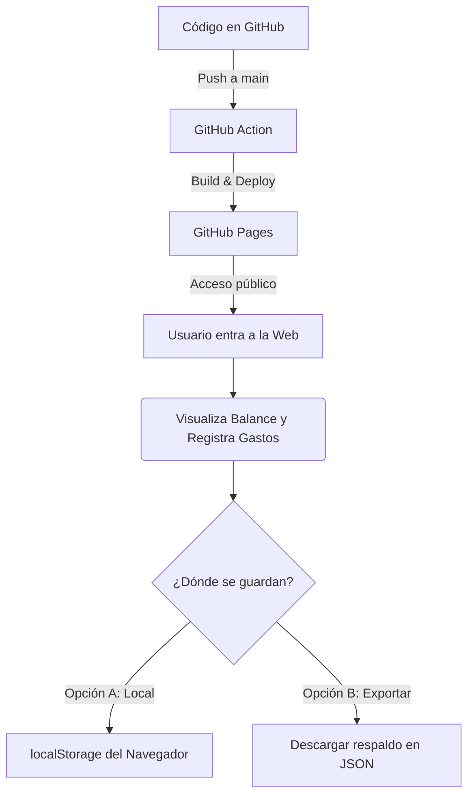

# Control de Gastos Personales 💸

Este proyecto consiste en una aplicación web interactiva y moderna para el control y seguimiento de gastos personales quincenales. El objetivo es proporcionar una interfaz visual premium y fácil de usar, desplegada automáticamente mediante **GitHub Actions**.

---

## 📊 Resumen Financiero Inicial

Confirmamos el cálculo de tu presupuesto quincenal y semanal:

| Concepto | Monto | Frecuencia | Detalles |
| :--- | :---: | :---: | :--- |
| **Sueldo Neto** | `$4,883.00` | Quincenal | Ingreso total neto recibido por quincena. |
| **Gastos Fijos** | `$3,000.00` | Quincenal | Comidas, transporte, renta e indispensables. |
| **Saldo Libre (Quincenal)** | **`$1,883.00`** | Quincenal | Dinero disponible para gastos variables/ahorro. |
| **Saldo Libre (Semanal)** | **`$941.50`** | Semanal | Saldo libre aproximado por semana ($1,883 / 2). |

### 🚦 Semáforo de Gastos Semanales (Dinero Libre)

Para mantener una salud financiera excelente, usaremos las siguientes alertas basadas en tu consumo de los **$941.50** semanales:

*   **🟢 Gasto Sano (Hasta $500.00 / semana):** Te permite ahorrar al menos **$441.50** semanales. ¡Excelente estado!
*   **🟡 Gasto Tolerable (Hasta $700.00 / semana):** Te permite ahorrar al menos **$241.50** semanales. Aceptable, pero con moderación.
*   **🔴 Límite Máximo (Hasta $941.50 / semana):** Te quedas con prácticamente $0.00 de ahorro semanal de tu dinero libre. No debes exceder esta cifra para no tocar tus gastos fijos ni endeudarte.

---

## 🛠️ Arquitectura y Flujo Propuesto

Para aprovechar al máximo que el repositorio será público y utilizar **GitHub Actions**, proponemos la siguiente arquitectura:

### 1. Aplicación Web Frontend (PWA)
* **Diseño Premium**: Interfaz moderna con tema oscuro/claro, bordes redondeados y efectos glassmorphism.
* **Dashboard Dinámico**:
  * Barra de progreso adaptativa de 5 niveles con semáforo inteligente.
  * Límites y marcadores de barra de progreso que se ajustan dinámicamente según la penalización activa.
  * Historial de transacciones de gastos variables con iconos por categoría y eliminación rápida.
  * Modal de confirmación estilizado en reemplazo de los cuadros genéricos del navegador.
* **Persistencia y Respaldo**: Uso de `localStorage` para almacenamiento local privado en tu dispositivo, con botones para exportar e importar copias de seguridad en formato JSON.
* **Soporte PWA (Offline)**: Registro de Service Worker (`sw.js`) y `manifest.json` para instalarse como aplicación independiente en iOS/Android y funcionar completamente sin conexión a internet.

### 2. Automatización con GitHub Actions
* Workflow configurado en `.github/workflows/deploy.yml`.
* Cada vez que se realiza un cambio (`git push`), GitHub Actions compila y despliega la web de forma segura en **GitHub Pages**.
* URL pública para el acceso desde tu celular: `https://AlanGF1.github.io/GASTOS/`.

---

## 🚦 Lógica Matemática del Presupuesto

* **Sueldo Quincenal Base:** `$4,883.00 MXN`
* **Gastos Fijos Quincenales:** `$3,000.00 MXN` (Alimentación, renta, transporte base).
* **Dinero Libre Quincenal:** `$1,883.00 MXN` (Equivale a `$941.50 MXN` semanales).
* **Colchón Semanal de Propinas:** `$1,000.00 MXN` (Actúa como amortiguación).
* **Límite Absoluto Semanal:** `$1,941.50 MXN` (`$941.50` libres + `$1,000.00` propina).
* **Penalización por Excedente:** Si en una semana el gasto total supera los `$1,941.50`, el excedente exacto se calcula automáticamente cronológicamente y se resta de los límites de la semana siguiente.
